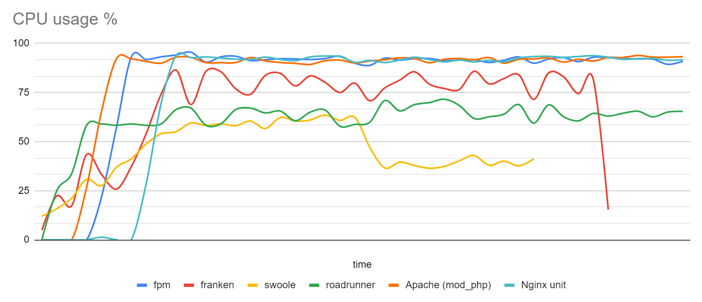
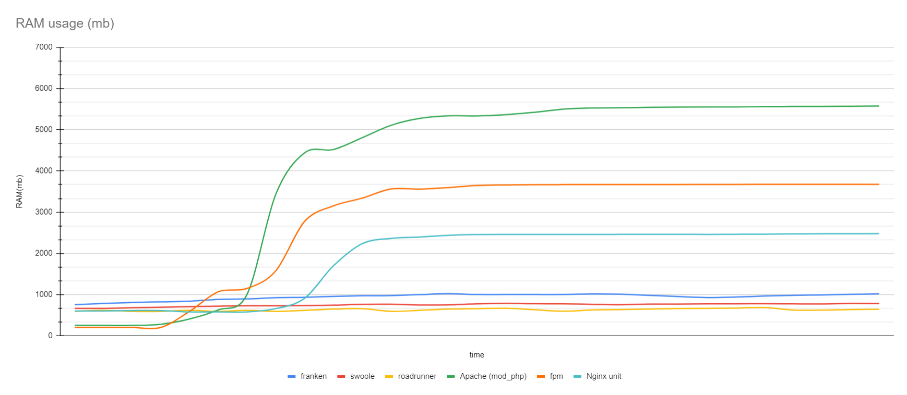
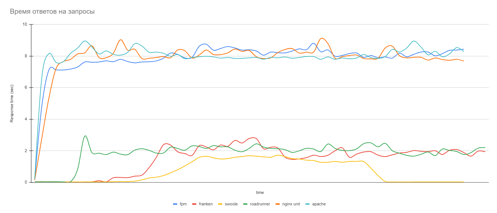

# PHP server load tests

## Команды для запуска серверов

### FPM
`docker compose -f compose.yml -f compose.fpm.yml up -d --build`

url: fpm-127-0-0-1.nip.io:8080

### Franken
`docker compose -f compose.yml -f compose.franken.yml up -d --build`

url: franken-127-0-0-1.nip.io:8080

### RoadRunner
`docker compose -f compose.yml -f compose.rr.yml up -d --build`

url: rr-127-0-0-1.nip.io:8080

### Swoole
`docker compose -f compose.yml -f compose.swoole.yml up -d --build`

url: swoole-127-0-0-1.nip.io:8080

### Nginx Unit
`docker compose -f compose.yml -f compose.unit.yml up -d --build`

url: unit-127-0-0-1.nip.io:8081

### Apache mod_php
`docker compose -f compose.yml -f compose.apache.yml up -d --build`

url: apache-127-0-0-1.nip.io:8080

## Запуск с установкой
При первом запуске локально необходимо выполнить, чтобы установился Bagisto и выполнились seed'ры

`docker compose -f compose.yml -f compose.fpm.yml -f compose.init.yml up -d --build`

Для генерации товаров
`php artisan db:seed --class=ProductSeeder --force && php artisan generate:product-links`

После скопировать содержимое app/storage/product_links.txt в tank/uris.txt

При тестировании Yandex tank необходимо заменить Host в tank/load.yaml на тестируемый.

## Доступ в админку

{url}:8080/admin

login: `admin@example.com`

pw: `admin123`

## Результаты тестов

| Сервер         | AVG CPU (%) | AVG RAM (mb) | AVG RPS | Результат yandex tank  |
|----------------|-------------|--------------|---------|------------------------|
| fpm            | 87          | 3500         | 37.3    | https://clck.ru/3Dbnig |
| franken        | 68          | 954          | 140.7   | https://clck.ru/3DbqLi |
| RoadRunner     | 60          | 638          | 131.5   | https://clck.ru/3DbpkP |
| swoole         | 45          | 752          | 152.5   | https://clck.ru/3DbnXQ |
| Nginx unit     | 87          | 2384         | 39.1    | https://clck.ru/3DbpLp |
| Apache mod_php | 89          | 5277         | 37.5    | https://clck.ru/3DboQw |

### График использования CPU
 

### График использования памяти
 

### График времени ответов от сервера
 